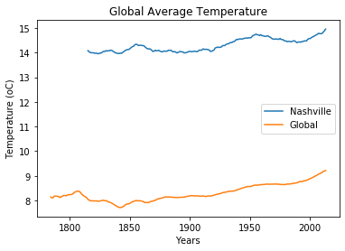

```python
import numpy as np # for calculating the moving average
```


```python
import pandas as pd # for dealing with data
```


```python
from matplotlib import pyplot as plt # for plotting the data
```


```python
data = pd.read_csv("results.csv") # importing the csv file
```


```python
# calculating the moving average - source: 
# https://pandas.pydata.org/pandas-docs/stable/reference/api/pandas.core.window.Rolling.mean.html

moving_average_global = data["avg_temp"].rolling(35).mean()
moving_average_city = data["avg_tempcity"].rolling(35).mean()

```


```python
#plotting the data - source:
#https://swcarpentry.github.io/python-novice-gapminder/09-plotting/

plt.plot(data["year"], moving_average_city, label = "Nashville")
plt.plot(data["year"], moving_average_global, label = "Global")
plt. legend()
plt.xlabel("Years")
plt.ylabel("Temperature (oC)")
plt.title("Global Average Temperature")
plt. show()
```





```python

```
